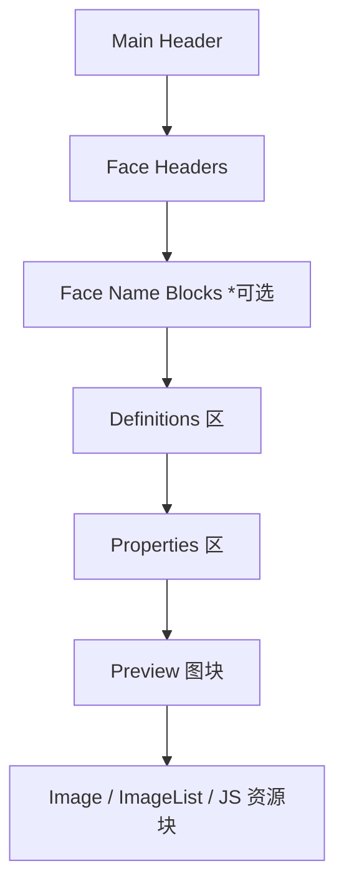

# Mi8WfBinTool

一个轻量、高效的独立命令行工具，用于解包（Unpack）与打包（Pack）小米/红米智能手环及手表的表盘文件（`.bin` / `.watch`）。

---

## 🌟 功能特性

- **完整二进制表盘解包与打包**：完美支持包含二进制表格控件（D7 结构）、图元、指针、JS 逻辑块、跳转组件等多元素的表盘解析。
- **完美的控件索引保存**：已修复解包时 widget 的 `prop7Index` 索引偏移丢失漏洞，确保打包后与原厂固件保持 100% 结构对齐与兼容性。
- **高压缩率算法适配**：完整还原 RLE 压缩，可达成超小体积的无损压包。
- **多代手环/手表全面兼容**：从使用 ZIP 代码格式的**小米手环 7**，到使用二进制结构的**小米手环 8/9/10/手表系列**全覆盖。

---

## 📱 支持设备与参数映射表

在运行命令时，可以通过指定最后一个参数 `[device]` 来启用针对特定设备的打包/解包优化逻辑。

| 真实设备中文名称 | 设备代号 / 广播名 | 工具输入参数 `dev` | 内部处理归属 | 表盘文件类型 | 格式与压缩特性 |
| :--- | :--- | :--- | :--- | :--- | :--- |
| **小米手环 7** | `miwear.watch.l66` | `mi7` 或 `l66` | `mi7` | **ZIP 格式** | 标准 Zepp OS 项目包，解包为 `app.json` 与 JS 源码目录。 |
| **小米手环 7 Pro**| `hqbd3.watch.l67` | `mi7pro` | `mi7pro` | 二进制格式 | 使用 RLE V1.1 压缩，指针默认不使用 alpha 通道。 |
| **小米手环 8** | `miwear.watch.m66` | `mi8` | `mi8` | 二进制格式 | 支持 `type_element_js` 等 JS 逻辑定义块。 |
| **小米手环 8 Pro**| `lchz.watch.m67` | `mi8pro` | `mi8pro` | 二进制格式 | 表盘头部偏移 `0xA8`，默认使用 RLE V2.0 索引色压缩。 |
| **红米手表 4** | `lchz.watch.n65` | `rw4` | `mi8pro` | 二进制格式 | 共享 `mi8pro` 核心编码规范。 |
| **小米手环 9** | `miwear.watch.n66` | `n66` | `mi8pro` | 二进制格式 | 共享 `mi8pro` 编码规范，但所有图片强制使用 24位 RGB888 格式（Sign `6`）。 |
| **小米手环 9 Pro**| `miwear.watch.n67` | `n67` | `mi8pro` | 二进制格式 | 共享 `mi8pro` 编码规范。 |
| **红米手表 5** | `miwear.watch.o65` | `o65` | `mi8pro` | 二进制格式 | 共享 `mi8pro` 编码规范。 |
| **小米手环 10** | `miwear.watch.o66` | `o66` | `mi8pro` | 二进制格式 | 共享 `mi8pro` 编码规范。 |
| **红米手表 6** | `miwear.watch.p65` | `p65` | `mi8pro` | 二进制格式 | 共享 `mi8pro` 编码规范。 |
| **小米手表 S3** | `mijia.watch.n62` | `ws3` | `ws3` | 二进制格式 | 激活 `isWatch3` 属性，支持 RLE V2.0 解压。 |
| **小米手表 4 Sport**| `mijia.watch.n62s` | `ws4s` | `ws4s` | 二进制格式 | 独立二进制大类。 |
| **小米手表 4** | `mijia.watch.o62` | `O62` | `O62` | 二进制格式 | 独立二进制大类。 |
| **小米手表 S5** | `miwear.watch.p62` | `P62` | `P62` | 二进制格式 | 独立二进制大类。 |

---

## 🛠️ 快速开始

### 1. 编译工具
工具使用原生 Java 编写，无任何第三方依赖，直接进行编译即可：
```bash
javac Mi8WfBinTool.java
```

### 2. 解包表盘 (Unpack)
将表盘 `.bin` 文件解包到工作目录中：
```bash
java Mi8WfBinTool unpack <表盘文件.bin> <输出目录> [device]
```
- **二进制表盘示例（小米手环 8 Pro）：**
  ```bash
  java Mi8WfBinTool unpack resource.bin ./out_dir mi8pro
  ```
- **ZIP 表盘示例（小米手环 7）：**
  ```bash
  java Mi8WfBinTool unpack resource.bin ./out_dir mi7
  ```

### 3. 打包表盘 (Pack)
将解包后的工作目录重新打包为表盘 `.bin` 文件：
```bash
java Mi8WfBinTool pack <工作目录> <输出文件.bin> [device]
```
- **二进制表盘示例（小米手环 8 Pro）：**
  ```bash
  java Mi8WfBinTool pack ./out_dir new_resource.bin mi8pro
  ```
- **ZIP 表盘示例（小米手环 7）：**
  ```bash
  java Mi8WfBinTool pack ./out_dir new_resource.bin mi7
  ```

---

## 📂 解包目录结构说明

### 二进制格式表盘（如 Mi8/Mi9/手表等）
解包后，输出目录包含以下内容：
- `wfDef.json`：表盘描述核心配置文件。包含表盘属性、元素定位坐标、控件定义及引用关系。**可以直接在 JSON 中修改坐标、层级或跳转逻辑。**
- `images/`：存放所有图片资源的文件夹。工具在解包时已将二进制数据自动还原为标准的 PNG 格式，可以直接在其中替换或修改图像。

### ZIP 代码格式表盘（如 Mi7）
解包后，直接还原为 Zepp OS 项目源码目录：
- `app.json`：定义 appId、i18n 多语言配置等。
- `assets/`：表盘图片资源目录。
- `watchface/`：存放表盘 JavaScript 主逻辑渲染代码。

---

## 💾 二进制表盘文件结构解析 (BIN Structure)

> [!NOTE]
> 默认所有整数均采用 **小端字节序 (Little-Endian)** 存储。

### 📅 总体物理布局
一个典型的二进制表盘文件由以下几个部分按物理顺序拼接而成：



在多表盘样式（Named Face 模式）下，落盘输出的物理顺序为：
1. **主头部 (Main Header)**：记录表盘整体元数据与全局偏移。
2. **表盘子头部 + 名称块 (Face Headers & Name Blocks)**：每个样式的子定位表及对应名称。
3. **全局定义表 (Definitions)**：全局唯一标识符（Definition Index）映射与指向。
4. **属性数据区 (Properties)**：各表盘样式的控件属性（如坐标、类型、数据源）。
5. **预览图 (Preview Images)**：各个样式的预览小图。
6. **全局去重资源块 (Resource Blocks)**：图片、图组（ImageList）、以及 JS 代码脚本。资源落盘物理顺序根据它们在 definitions 中“首次被引用”的顺序来决定。

### 1. 主头部 (Main Header)
主头位于 BIN 文件最前端，固定长度为 `0xA8` 字节，包含表盘的基础属性：

| 字节偏移范围 | 字段名称 | 字节大小 | 描述 |
| :--- | :--- | :---: | :--- |
| `0x00 .. 0x03` | `magic` | 4 字节 | 固定为 `5A A5 34 12` |
| `0x10 .. 0x13` | `device` | 4 字节 | 设备标志位（例如 `mi7pro` 会在此处写入 `0x800`，不同设备对应不同标志） |
| `0x1C .. 0x1D` | `faceCount` | 2 字节 | 包含的表盘子样式总数 |
| `0x1E .. 0x1F` | `faceStyleCount` | 2 字节 | 表盘最大支持的样式切换数 |
| `0x20 .. 0x23` | `previewOffset` | 4 字节 | 顶层全局预览图的绝对偏移位置 |
| `0x28 .. 0x30` | `id` | 9 字节 | ASCII 码表盘 ID |
| `0x68 .. 0xA3` | `name` | 60 字节 | UTF-8 / ASCII 码表盘名称（以 `0x00` 填充截断） |

### 2. 子表盘头部 (Face Header)
每个表盘样式（Face）都会对应一个 `Face Header`，固定长度为 `0x58` 字节。
每个 section 在 Face Header 中通过 **一对 `u32`** 组合来记录：
* **前 4 字节**：`count`（元素个数）
* **后 4 字节**：`offset`（该属性区在文件中的绝对偏移量）

| 偏移范围 | 对应的属性块 / Section |
| :--- | :--- |
| `0x00 .. 0x03` | 保留字段 |
| `0x04 .. 0x07` | `previewOffset`（子表盘预览图物理偏移，不存在时为 `0`） |
| `0x08 .. 0x0F` | `base elements` (基础图元组件) |
| `0x10 .. 0x17` | 保留字段 |
| `0x18 .. 0x1F` | `single images` (单图资源定义) |
| `0x20 .. 0x27` | `image lists` (图组资源定义) |
| `0x28 .. 0x2F` | `animations` (动画资源定义) |
| `0x30 .. 0x37` | `js` (JS逻辑脚本资源定义) |
| `0x38 .. 0x3F` | 保留字段 |
| `0x40 .. 0x47` | `prop7` + `extraProp7` (Widget 控件属性) |
| `0x48 .. 0x4F` | `extraProp8` (附加属性 8) |
| `0x50 .. 0x57` | `prop9` + `extraProp9` (Jump 跳转属性) |

### 3. 全局定义表 (Definitions)
定义表条目（Definition Item）固定长度为 **16 字节**，用于定义资源及控件的指针信息：

| 字节偏移范围 | 字段含义 | 说明 |
| :--- | :--- | :--- |
| `0x00 .. 0x01` | `idx` | 全局资源唯一索引（Definition Index） |
| `0x03` | `type` | 资源类型标识，不同数值代表不同的组件/资源： |
| | | - `0`: 基础图元（Base Element） |
| | | - `2`: 单张图片（Single Image） |
| | | - `3`: 图片序列（Image List） |
| | | - `4`: 动画组件（Element Animation） |
| | | - `5`: JS 资源脚本（JS Block） |
| | | - `7`: 控件属性定义（Widget Prop7） |
| | | - `8`: 附加属性定义（Extra Prop8） |
| | | - `9`: 跳转动作属性定义（Jump Prop9） |
| `0x08 .. 0x0B` | `offset` | 资源或配置数据在 BIN 中的绝对物理偏移地址 |
| `0x0C .. 0x0F` | `length` | 该数据段的物理长度（字节数） |

### 4. 属性数据块 (Properties)
属性数据块是各个 Face 私有的数据段，用于记录特定图元或控件的具体内容。

#### 4.1 Base Element (prop0)
每个 Base Element 占用 **16 字节**：
- `0x00 .. 0x01`：所引用的定义条目索引（Definition Index）
- `0x03`：组件展现形式（比如图片、数字、序列帧等）
- `0x04 .. 0x05`：相对横坐标 `x`
- `0x06 .. 0x07`：相对纵坐标 `y`

#### 4.2 Widget (prop7)
Widget 是表盘的核心交互与数据展示控件。在解析与打包时，工具兼顾了两层信息：
1. **语义化结构字段**：如数据源 `dataSrc`、图组索引 `imageList`、刷新间隔 `interval` 等。
2. **原始保底字节段 (`prop7Raw`)**：用于留存尚未被语义化逆向出来的保留字节位，确保打包后的 100% 对齐。

* 常用控件的内部长度规则：
  - **指针控件 (`widge_pointer`)**：固定长度 **32 字节**。
  - **进度条控件 (`widge_process`)**：固定长度 **40 字节**。
  - **图片列表控件 (`widge_imagelist`)**：若有图片列表，长度为 `16 + 4 * 图片张数`。
  - **普通文本与数字控件**：固定长度 **20 字节**。

#### 4.3 Jump (prop9)
Jump 模块对应表盘的快捷跳转操作区。
- **普通快捷跳转**：固定长度 **52 字节**。
- **特定跳转 (`jumpCode` = `01008223` / 支付宝等复杂快捷方式)**：固定长度 **56 字节**。

### 5. 图片与资源编码 (Image & Resources)
所有图片、图组和 JS 资源在文件尾部按去重逻辑排列。

#### 5.1 图像数据块头部 (Image Block Header)
每个图像资源的前 **12 字节**为通用描述头：

| 字节偏移 | 字段含义 | 说明 |
| :---: | :--- | :--- |
| `0x00` | `sign` | 编码格式特征（`6`: RGB888 无透明, `9`: RLE V1.1, `10`/`16`: 256索引调色板 RLE V2.0, `14`: ARGB8888 原始等） |
| `0x01` | `flags` / `count` | 在单图里为 0；在图组（ImageList）中表示子图片张数 |
| `0x02` | `compress` | 压缩模式标志位（`4` 或 `8`） |
| `0x04 .. 0x05`| `width` | 图像宽度 |
| `0x06 .. 0x07`| `height` | 图像高度 |
| `0x08 .. 0x0B`| `length` | 图像的实际压缩负载（Payload）字节数 |

* 游程压缩 (RLE) 版本特征：
  - **RLE V1.0** (`decV10` / `encV10`)：早期的游程长度压缩算法。
  - **RLE V1.1** (`decV11` / `encV11`)：常见于 `mi7pro` 平台，指针及特殊区域采用。
  - **RLE V2.0** (`decV20` / `encV20`)：基于调色板的全局索引用色游程压缩，常用于 `mi8pro` 等色彩丰富的现代化设备。支持最大 256 色全局调色板编码，压缩效率最高。

#### 5.2 JS 脚本资源结构 (JS Block)
JS 脚本用于表盘的 JS 引擎渲染，其块结构如下：
- **前 4 字节**：JS 脚本内容的总长度。
- **后 2 字节**：脚本文件名的长度。
- **文件名段**：对应长度 of ASCII 字符串文件名（例如 `index.js`）。
- **脚本内容段**：原始的 JS 文本字节。

---

## 🔬 验证与双向对齐建议

当你修改完表盘配置文件或更换图片后，可以通过以下步骤验证工具生成的二进制结构是否安全：

1. **原始文件解包**：
   ```bash
   java Mi8WfBinTool unpack resource.bin ./workspace mi8pro
   ```
2. **不做修改直接打包**：
   ```bash
   java Mi8WfBinTool pack ./workspace repacked.bin mi8pro
   ```
3. **将重打包生成的文件再次解包**：
   ```bash
   java Mi8WfBinTool unpack repacked.bin ./re_workspace mi8pro
   ```
4. **比对一致性**：
   使用文本比对工具（如 VS Code Diff）比对 `./workspace/wfDef.json` 与 `./re_workspace/wfDef.json`。若结构体中的 Widget 索引定位、控件长度和 section 数量完全一致，则说明打包后的二进制表盘在真机上运行时绝对安全。

---

## ⚠️ 免责声明
本工具仅供学习和交流表盘编码协议使用。打包出的表盘文件请在个人测试设备上使用，请勿用于商业及其他未授权用途。
